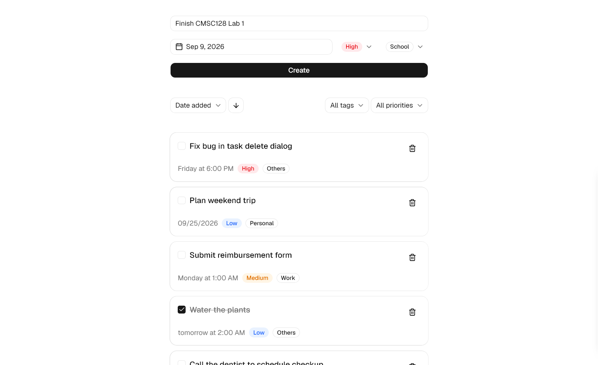
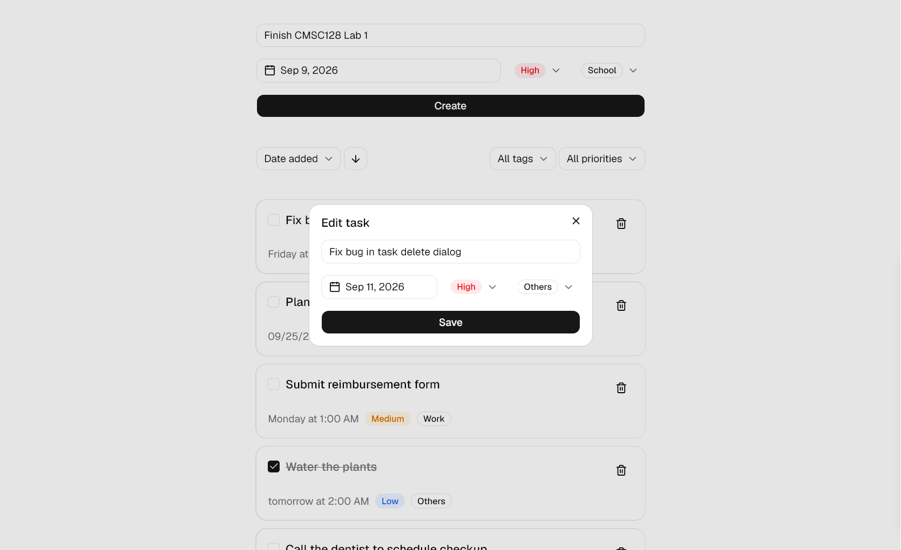
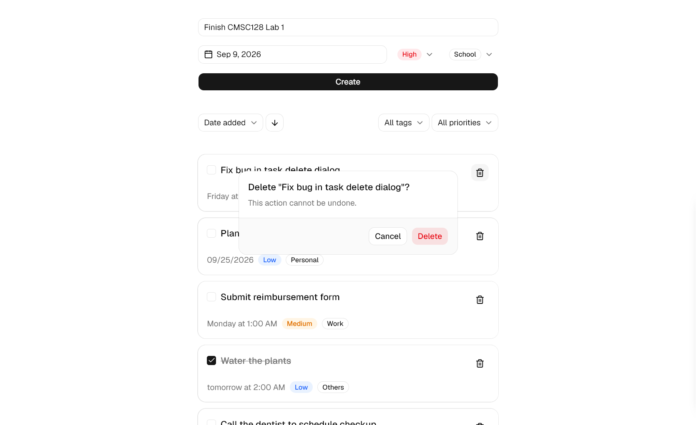

# CRUD To-Do List - CMSC 128 Lab

A to-do list app with create, read, update, and delete operations.

## Tech Stack

- Frontend: React + Vite + TypeScript
- Backend: Node.js + Express + TypeScript
- Database: MongoDB (via Mongoose)
- Validation: Zod
- Package manager: pnpm (monorepo with `frontend/` and `backend/` workspaces)

### Why this stack

I chose the MERN stack.

MongoDB fits a to-do list well because a task record has no need for relational joins and its shape (title, due date, priority, tag, done) can grow over the semester (like adding a `userId` field for Assign 2) without a schema migration.

Express gives minimal, unopinionated routing and middleware for a small API like this, without the boilerplate of a full-featured framework.

React with Vite gives fast local development and a component-based UI, which makes it straightforward to keep the task list, form, and filters as separate pieces.

TypeScript over plain JavaScript catches field typos and shape mismatches at compile time instead of at runtime.

One language (TypeScript) across frontend and backend also means one set of types and tooling to maintain, and the same task shape is defined on both sides with matching validation rules.

## Project Structure

```
/
├── backend/
│   └── src/
│       ├── config/          # env, db connection, swagger setup
│       ├── middleware/      # request validation
│       ├── modules/tasks/   # task model, schema, controller, service, router
│       └── server.ts        # Express app entry point
├── frontend/
│   └── src/
│       ├── api/             # HTTP calls to the backend
│       ├── components/      # UI components (task list, form, dialogs, etc.)
│       ├── hooks/           # useTasks (data + CRUD actions), useTaskView (sort/filter)
│       ├── schemas/         # Zod validation for forms
│       └── types/           # shared task types
└── README.md
```

## Prerequisites

- Node.js
- pnpm
- MongoDB running locally, or a MongoDB Atlas connection string

## Setup

Install dependencies for both workspaces:

```
pnpm install
```

Copy the environment files and adjust if needed:

```
cp backend/.env.example backend/.env
cp frontend/.env.example frontend/.env
```

`backend/.env` holds `MONGODB_URI`, `PORT`, and `CORS_ORIGIN`. `frontend/.env` holds `VITE_API_URL`. Neither file is committed; only the `.env.example` templates are.

Start MongoDB locally (skip this if using Atlas):

```
mongod
```

Run the backend:

```
cd backend
pnpm dev
```

Run the frontend in a separate terminal:

```
cd frontend
pnpm dev
```

## Verify

- Backend health check: http://localhost:3000/api/health
- API docs (Swagger UI): http://localhost:3000/api-docs
- Frontend: http://localhost:5173

## Data Model

Each task document in MongoDB has:

| Field       | Type     | Notes                                               |
| ----------- | -------- | --------------------------------------------------- |
| `_id`       | ObjectId | assigned by MongoDB, used to identify each task     |
| `title`     | String   | required                                            |
| `dueDate`   | Date     | optional                                            |
| `priority`  | String   | `Low`, `Medium`, `High`, or `None` (default)        |
| `tag`       | String   | `Work`, `School`, `Personal`, or `Others` (default) |
| `done`      | Boolean  | defaults to `false`                                 |
| `createdAt` | Date     | set automatically by Mongoose timestamps            |
| `updatedAt` | Date     | set automatically by Mongoose timestamps            |

## API Endpoints

All routes are prefixed with `/api` and validated with Zod before reaching the database.

| Method | Endpoint         | Description                                            |
| ------ | ---------------- | ------------------------------------------------------ |
| GET    | `/api/tasks`     | List all tasks                                         |
| GET    | `/api/tasks/:id` | Get a single task by id                                |
| POST   | `/api/tasks`     | Create a task                                          |
| PATCH  | `/api/tasks/:id` | Update a task (any subset of fields, including `done`) |
| DELETE | `/api/tasks/:id` | Delete a task                                          |

Example create request body:

```json
{
  "title": "Finish lab report",
  "dueDate": "2026-09-15T23:59:00.000Z",
  "priority": "High",
  "tag": "School"
}
```

Example update request body (marking a task done):

```json
{ "done": true }
```

Full request/response schemas are available at `/api-docs`.

## Features

### Minimum requirements

- Task list view showing title, due date, priority, and tag for every task.
- Add task with title, due date and time, priority, and tag.
- Edit task, updating any of the above fields.
- Delete task, guarded by a confirmation dialog.
- Mark task as done, shown with a strikethrough and a checkbox.
- Data persists in MongoDB and survives a browser refresh or server restart.

### Expanded features (2 of 3 implemented)

**Undo on delete.** Deleting a task removes it from the visible list immediately and shows a toast with an "Undo" action for 5 seconds. The task is only deleted from the database once the toast is dismissed, times out, or a new delete replaces it.
Clicking "Undo" restores it to the list instead. This logic lives in `frontend/src/hooks/useTasks.ts`.

**Sort and filter.** Tasks can be sorted by date added, due date, priority, or tag, in ascending or descending order, and filtered by tag and priority. Sorting and filtering happen on client-side over the already-fetched task list. This logic lives in `frontend/src/hooks/useTaskView.ts`.

## Screenshots




