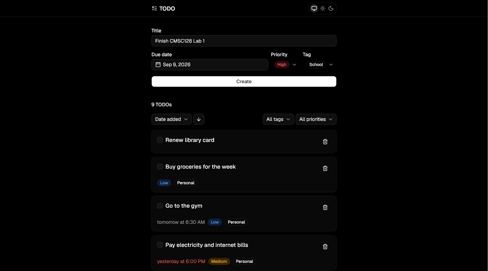
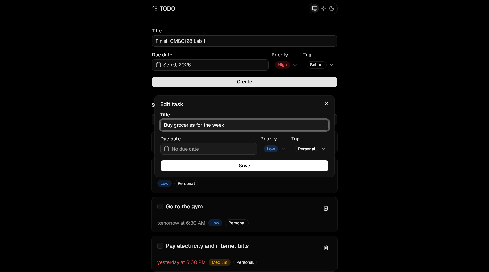
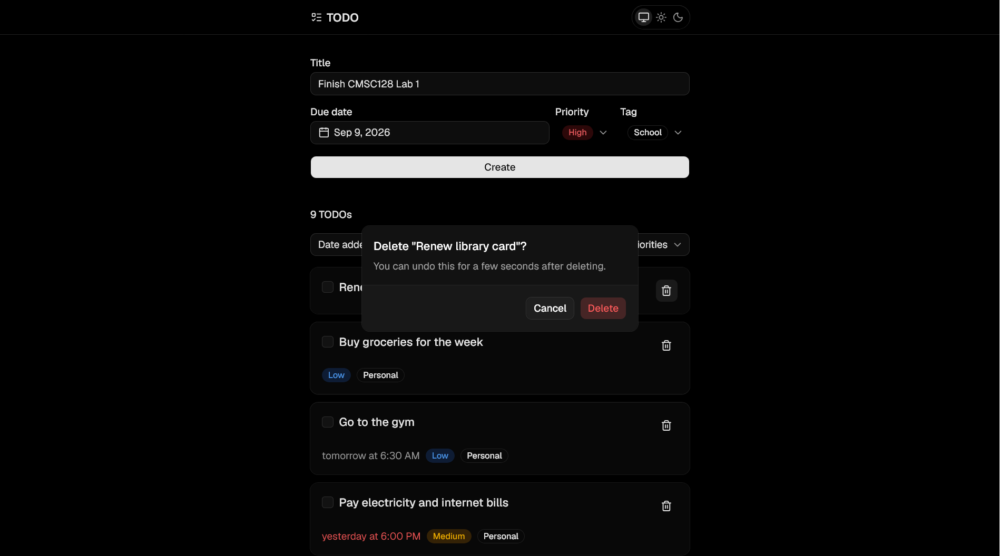

# TODO

A to-do list app built with the MERN stack.

## Features

### Task Management

- Task list showing title, due date, priority, and tag for every task.
- Add tasks with title, due date and time, priority, and tag.
- Edit any field of a task.
- Delete tasks behind a confirmation dialog.
- Undo a delete within 5 seconds via a toast; the task is only removed from the database once the toast closes (`frontend/src/hooks/useTasks.ts`).
- Mark tasks as done, shown with a checkbox and strikethrough.
- Sort by date added, due date, priority, or tag (ascending or descending), and filter by tag and priority, client-side (`frontend/src/hooks/useTaskView.ts`).
- Tasks persist in MongoDB across browser refreshes and server restarts.

### Accounts

- Register, log in, and log out.
- Stay logged in across refreshes and backend restarts.
- Profile page, and settings to change display name, email, and password.
- Password recovery via an emailed reset link.

## Tech Stack

- Frontend: React + Vite + TypeScript
- Backend: Node.js + Express + TypeScript
- Database: MongoDB (via Mongoose)
- Validation: Zod
- Auth: server-side sessions (`express-session` + `connect-mongo`), Argon2id password hashing (`argon2`)
- Email: `nodemailer` over SMTP
- Package manager: pnpm (monorepo with `frontend/` and `backend/` workspaces)

### Why this stack

I chose the MERN stack.

MongoDB fits a to-do list well because a task record has no need for relational joins and its shape (title, due date, priority, tag, done) can grow over the semester (like adding a `userId` field for Assign 2) without a schema migration.

Express gives minimal, unopinionated routing and middleware for a small API like this, without the boilerplate of a full-featured framework.

React with Vite gives fast local development and a component-based UI, which makes it straightforward to keep the task list, form, and filters as separate pieces.

TypeScript over plain JavaScript catches field typos and shape mismatches at compile time instead of at runtime.

One language (TypeScript) across frontend and backend also means one set of types and tooling to maintain, and the same task shape is defined on both sides with matching validation rules.

Server-side sessions can be revoked immediately (on logout or password change), unlike JWTs, and storing them in MongoDB avoids adding another service. Argon2id is the password hash recommended by OWASP.

## Project Structure

```
/
├── backend/
│   └── src/
│       ├── config/          # env, db connection, sessions, swagger setup
│       ├── lib/             # password hashing, email sending
│       ├── middleware/      # request validation, auth guard, errors
│       ├── modules/         # feature modules: auth, users, tasks (model, schema, controller, service, router)
│       └── server.ts        # Express app entry point
├── frontend/
│   └── src/
│       ├── api/             # HTTP calls to the backend
│       ├── components/      # UI components
│       ├── hooks/           # data and view-state hooks
│       ├── lib/             # fetch wrapper, route auth guards
│       ├── routes/          # pages
│       ├── schemas/         # Zod validation for forms
│       └── types/           # shared types
└── README.md
```

## Prerequisites

- Node.js
- pnpm
- MongoDB running locally, or a MongoDB Atlas connection string

## Setup

Install dependencies for both workspaces:

```
pnpm install
```

Copy the environment files and fill them in:

```
cp backend/.env.example backend/.env
cp frontend/.env.example frontend/.env
```

`backend/.env` holds `MONGODB_URI`, `PORT`, `CORS_ORIGIN`, `APP_URL`, `SESSION_SECRET`, and the optional SMTP settings (see `.env.example`). `frontend/.env` holds `VITE_API_URL`. Neither file is committed; only the `.env.example` templates are.

Generate `SESSION_SECRET` with:

```
node -e "console.log(require('crypto').randomBytes(32).toString('hex'))"
```

Start MongoDB locally (skip this if using Atlas):

```
mongod
```

Run the backend:

```
cd backend
pnpm dev
```

Run the frontend in a separate terminal:

```
cd frontend
pnpm dev
```

No migrations or seeds are needed; collections and indexes are created automatically.

## Verify

- Backend health check: http://localhost:3000/api/health
- API docs (Swagger UI): http://localhost:3000/api-docs
- Frontend: http://localhost:5173

## Data Model

### Task

| Field       | Type     | Notes                                               |
| ----------- | -------- | --------------------------------------------------- |
| `_id`       | ObjectId | assigned by MongoDB, used to identify each task     |
| `title`     | String   | required                                            |
| `dueDate`   | Date     | optional                                            |
| `priority`  | String   | `Low`, `Medium`, `High`, or `None` (default)        |
| `tag`       | String   | `Work`, `School`, `Personal`, or `Others` (default) |
| `done`      | Boolean  | defaults to `false`                                 |
| `createdAt` | Date     | set automatically by Mongoose timestamps            |
| `updatedAt` | Date     | set automatically by Mongoose timestamps            |

### User

| Field          | Type     | Notes                                        |
| -------------- | -------- | -------------------------------------------- |
| `_id`          | ObjectId | assigned by MongoDB, used to identify a user |
| `email`        | String   | required, unique                             |
| `displayName`  | String   | required                                     |
| `passwordHash` | String   | Argon2id hash; never returned by the API     |

## API Endpoints

All routes are prefixed with `/api` and validated with Zod before reaching the database. Full request/response schemas are available at `/api-docs`.

### Tasks

| Method | Endpoint         | Description                                            |
| ------ | ---------------- | ------------------------------------------------------ |
| GET    | `/api/tasks`     | List all tasks                                         |
| GET    | `/api/tasks/:id` | Get a single task by id                                |
| POST   | `/api/tasks`     | Create a task                                          |
| PATCH  | `/api/tasks/:id` | Update a task (any subset of fields, including `done`) |
| DELETE | `/api/tasks/:id` | Delete a task                                          |

Example create request body:

```json
{
  "title": "Finish lab report",
  "dueDate": "2026-09-15T23:59:00.000Z",
  "priority": "High",
  "tag": "School"
}
```

Example update request body (marking a task done):

```json
{ "done": true }
```

### Auth and Users

| Method | Endpoint                    | Description                                 |
| ------ | --------------------------- | ------------------------------------------- |
| POST   | `/api/auth/register`        | Create an account and log in                |
| POST   | `/api/auth/login`           | Log in                                      |
| POST   | `/api/auth/logout`          | Log out                                     |
| GET    | `/api/auth/me`              | Get the logged-in user                      |
| POST   | `/api/auth/forgot-password` | Email a password reset link                 |
| POST   | `/api/auth/reset-password`  | Set a new password with a reset token       |
| PATCH  | `/api/users/me`             | Change display name                         |
| PATCH  | `/api/users/me/email`       | Change email (requires current password)    |
| PATCH  | `/api/users/me/password`    | Change password (requires current password) |

Example register request body:

```json
{
  "email": "juan@example.com",
  "displayName": "Juan",
  "password": "password123"
}
```

## Authentication

### Sessions

On login, the backend stores a session (with the user's ID) in MongoDB's `sessions` collection and sends a signed, `httpOnly` session ID cookie. Each request looks up the session from the cookie, so the user stays logged in across refreshes and backend restarts. Logging out deletes the session and clears the cookie. Changing or resetting the password logs out other sessions.

### Password Recovery

Requesting a reset emails a link with a random token that expires in 30 minutes. Only the token's hash is stored, and it's cleared once used. Setting a new password replaces the hash, so the old password stops working.

If SMTP isn't configured, the email is printed to the backend terminal instead. This is for local development only: anyone with access to the server logs could use the link. The backend requires SMTP when `NODE_ENV=production`.

## Screenshots

### Task Management




